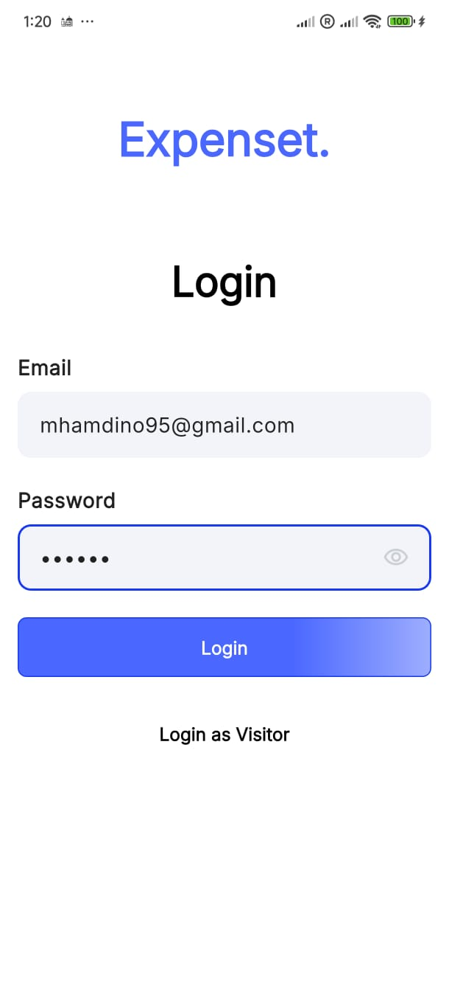
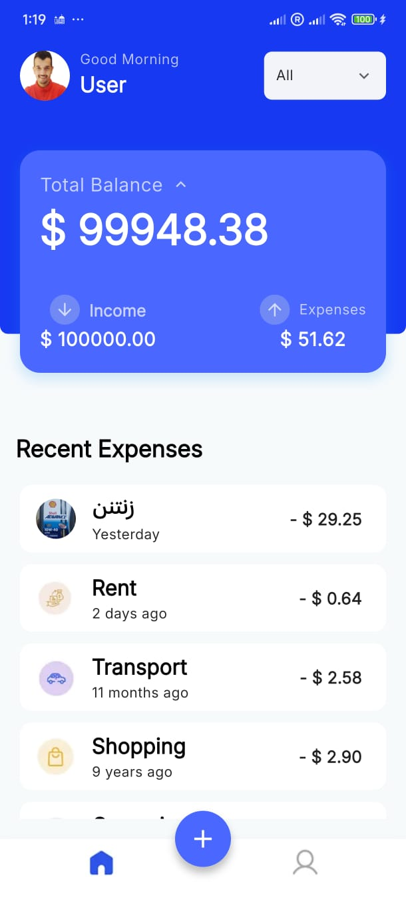
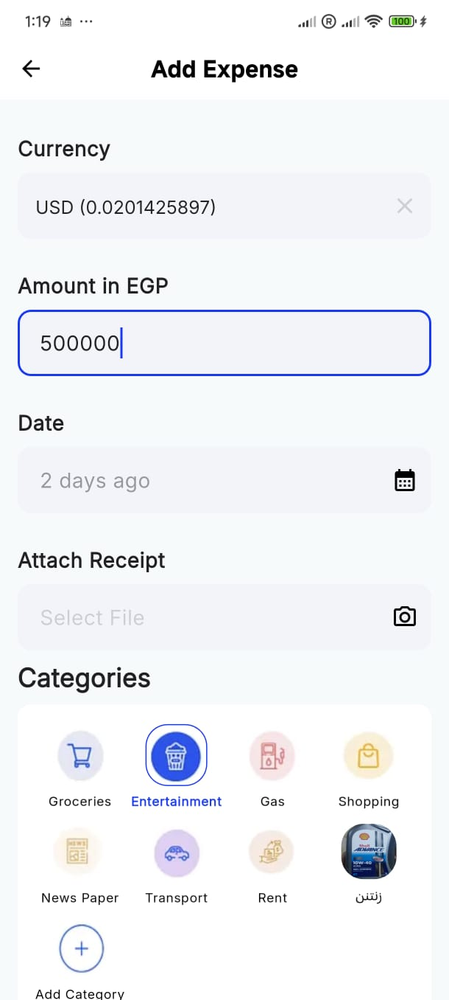

Flutter Clean Architecture Project

Overview

This Flutter application demonstrates best practices in mobile app development through a Clean Architecture approach. It incorporates robust state management using Bloc and Cubit, efficient offline support with ObjectBox, automated code generation via Mason, and scalable API integration using Dio. The architecture ensures high modularity, maintainability, and testability.

⸻

1. Architecture and Project Structure

The application strictly follows Clean Architecture principles, structured into well-defined layers with unidirectional dependencies:

Presentation Layer (lib/presentation)
	•	Pages: Top-level screens (e.g., HomePage, LoginPage).
	•	Widgets: Reusable UI components.
	•	Blocs/Cubits: Manage state and UI logic. Communicate with the domain layer.

Domain Layer (lib/domain)
	•	Entities: Core business objects (pure Dart, framework-agnostic).
	•	Use Cases: Contain business rules (e.g., GetExpensesUseCase).
	•	Abstract Repositories: Define contracts for data access.

Data Layer (lib/data)
	•	Models: API/ObjectBox specific data structures with serialization.
	•	Repositories: Implement abstract repositories with concrete logic.
	•	Data Sources:
	•	RemoteDataSource: For API calls.
	•	LocalDataSource: For ObjectBox operations.

Core Layer (lib/core)
	•	Common utilities, constants, exceptions, themes, network info, etc.

Mason Integration
	•	Utilizes custom bricks for auto-generating Blocs, UseCases, Repositories, and Models to ensure consistency and speed in development.

⸻

2. State Management

Uses Bloc and Cubit from flutter_bloc:

Why Bloc/Cubit?
	•	Predictable state flow
	•	Highly testable logic units
	•	Strict separation of concerns
	•	Scalable for complex features

How It Works
	•	UI dispatches Events or calls Methods on Bloc/Cubit.
	•	Bloc/Cubit calls UseCases from the domain layer.
	•	Emits new States, which the UI reacts to via BlocBuilder, BlocConsumer, etc.

⸻

3. API Integration

Dio + Clean Abstraction
	•	Abstract ApiService (e.g., ProductApiService) defines endpoint contracts.
	•	Concrete Implementation (e.g., ProductApiServiceImpl) uses Dio to:
	•	Handle authentication and interceptors
	•	Parse responses into Models
	•	Translate DioErrors into custom exceptions

Repository Layer
	•	Receives models from ApiService
	•	Converts Models -> Entities
	•	Returns Entities to UseCases

Dependency Injection
	•	Managed via injectable and get_it
	•	Easily inject ApiService, UseCases, Repositories, etc.

⸻

4. Pagination Strategy

API Pagination (Online)
	•	Fetches initial data (page=1, limit=20)
	•	Uses ScrollController to detect scroll end
	•	Loads next page if available and appends it
	•	Data cached to ObjectBox for offline access

Local Pagination (Offline)
	•	Retrieves paginated data from ObjectBox
	•	Efficient slicing logic using offset/limit:

Future<List<T>> getPaginatedData<T>(int page, int pageSize) async {
  final box = _getBox<T>();
  final startIndex = (page - 1) * pageSize;
  final allItems = box.getAll();
  if (startIndex >= allItems.length) return [];
  final endIndex = (startIndex + pageSize).clamp(0, allItems.length);
  return allItems.sublist(startIndex, endIndex);
}

⸻

5. UI Screenshots

### Login Screen:

### Home Screen (Balance & Recent Expenses):

### Add Expense Screen:

Includes smooth animations, visual feedback, and clean responsive layouts.

⸻

6. Trade-offs and Assumptions

Trade-offs
	•	High initial complexity: Due to layered architecture and DI setup.
	•	Verbose code: Multiple transformations (Model -> Entity).

Assumptions
	•	Stable backend API adhering to REST
	•	Initial internet required for first data sync
	•	Immutability in models and entities
	•	Basic error handling implemented (needs UI-friendly messages for production)
	•	get_it and injectable properly configured

⸻

7. How to Run the Project

Prerequisites
	•	Flutter SDK 3.29.3+
	•	Dart SDK
	•	VS Code / Android Studio
	•	Emulator or physical device

Setup Instructions

git clone <repository_url>
cd <project_folder>
flutter pub get
dart pub global activate mason_cli
flutter pub run build_runner build --delete-conflicting-outputs
flutter run

Run Tests

flutter test

⸻

8. DevOps (CI/CD)

GitHub Actions Workflows

build_and_test.yml (CI)
	•	Runs on: push to main, develop, PRs
	•	Steps:
	•	Checkout
	•	Install Flutter
	•	Run flutter pub get
	•	flutter analyze
	•	flutter test
	•	Build for Android/iOS

deploy_to_store.yml (CD)
	•	Triggers on: merge to main or manual dispatch
	•	Steps:
	•	Setup environment
	•	Build release
	•	Deploy using Fastlane / Store APIs

CI/CD ensures high quality, auto-tested builds and release pipelines with minimal manual intervention.

⸻

9. Known Bugs / Unimplemented Features
	•	Offline edit/sync conflict resolution (planned)
	•	UI polish in dark mode (WIP)
	•	Localization support (planned)
	•	Unit tests coverage for all use cases (partial)

⸻

For any questions or contributions, feel free to open issues or pull requests. Happy coding! 🚀